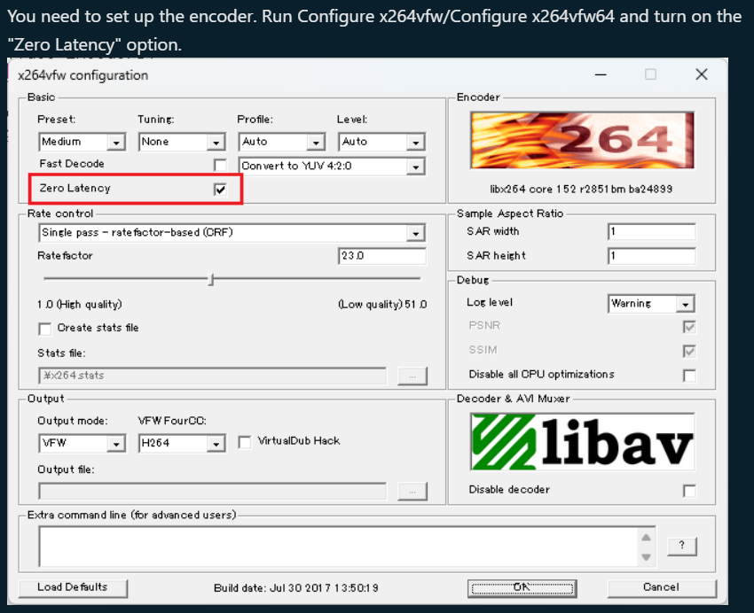

## Features

* **Full Screen Recording:** Capture everything happening on your Windows desktop in high quality.
* **Simultaneous System Audio Recording:** Record the audio that accompanies your screen activity, ensuring a complete recording experience.
* **User-Friendly GUI:** Navigate the application effortlessly with a clean and intuitive interface.

## Installation

Before using this program, you'll need to install the **x264vfw** software, which is available on SourceForge.net. You can download the latest version from the following link:

[x264vfw - Browse Files at SourceForge.net](https://sourceforge.net/projects/x264vfw/files/)

**Note:** Make sure to download the appropriate installer for your system architecture (32-bit or 64-bit).

Once downloaded, run the installer and follow the on-screen instructions to complete the installation.

## Configuration (Optional)

This section is optional, but if you'd like to further configure x264vfw for optimal use with the recorder, refer to the following image:

**Note:** Ensure the image file "x264vfw_configuring.png" is uploaded to your GitHub repository.

## Usage

To use the C# Screen and Audio Recorder, simply run the application and click the "Start" button. The program will capture your full screen and system audio, saving the recording to a file on your local machine.

